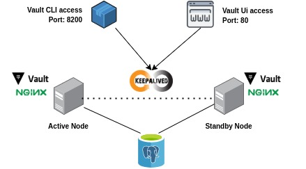

# Hashicorp Vault Cluster HA with PostgreSQL back-end



## Objective

The main objective of this repository is to practice the knowledge acquired and streamline the process of provisioning the environment using **Ansible**.

Make a high availability cluster available using the Hashicorp Vault password management tool.

This Cluster must be accessed through the Hashicorp Vault CLI and Web Ui.

In this project, two machines were used for the installation of Hashicorp Vault and one machine for the installation of PostgreSQL which will be the system used as a back-end for storing Vault passwords.


## Features

In this project there are some characteristics that you should be aware of.

- The vault service is started unsealed
Every time the Vault service is started, a **/usr/local/bin/unsealing** script is run. This script has all the keys to unseal the vault.

- Vault active node verification
In the keepalived configuration file there is a ** vrrp_script ** that executes a script **/usr/local/bin/cluster_check** to check which Vault cluster's active node. In this way keepalived is able to identify which host should receive the VIP address.

- After the playbook has successfully run, a file called **vault_secrets.vkey** will be created with unseal and root token keys.


## Vagrant

If you have VirtualBox and Vagrant you have a **Vagrantfile** file with the provision of three machines for your test environment. Remember to change the file with the IP addresses you like best.

```sh
vagrant up
```

## Run Playbook

Before starting the playbook check the information in the hosts **inventories/dev/hosts** file and the file containing the **vars/configs.yml** configuration variables.

It is also necessary to inform by parameters --extra-vars the following variables:

- keep_pass
- pgsql_password


```sh
ansible-playbook -i inventories/dev/hosts \
play.yml \
--extra-vars='keep_pass=your_keepalived_password' \
--extra-vars='pgsql_password=your_database_password'
```